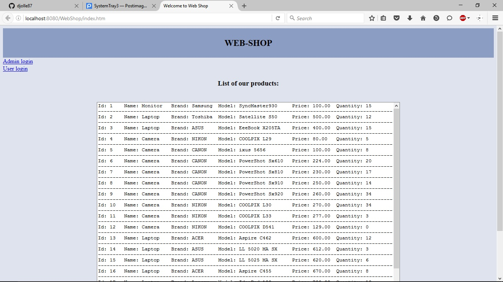
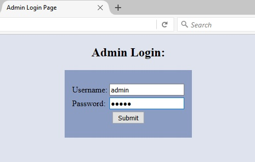
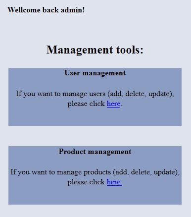
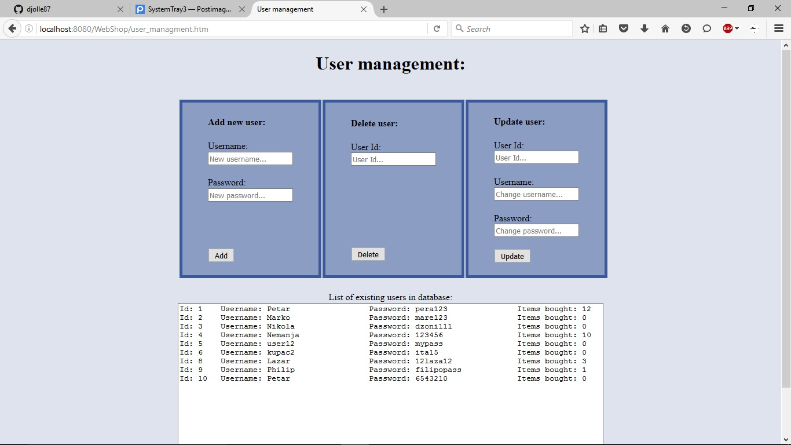
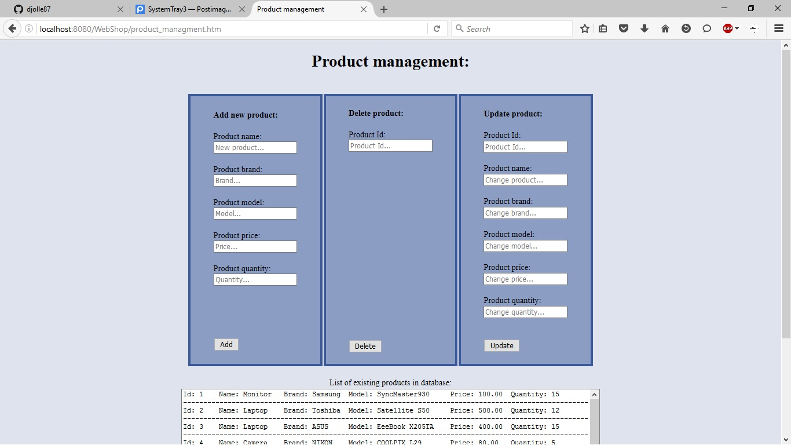
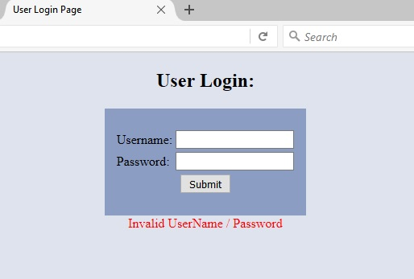
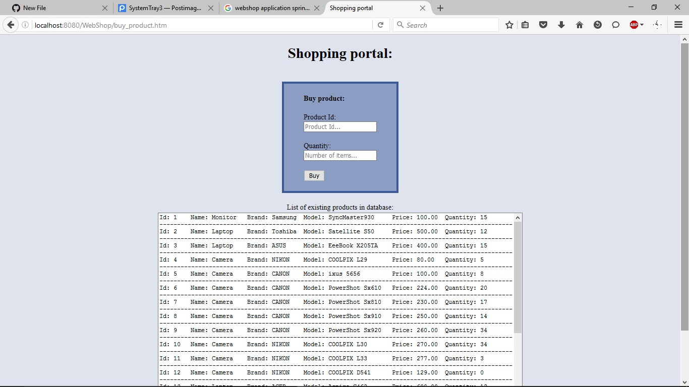
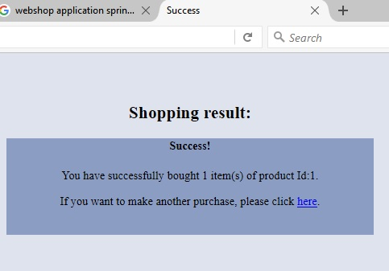

# WebShop
WebShop is online shopping system built in Java, with Spring MVC Framework and Glass Fish Server. To test this app, you will need a database (MySQL).
To login as admin use admin, admin for username and password. You can manage other user accounts (their username, passwords....) as well as product list.
* As an admin, you will have access to the databases of all users and products. You will have detailed insight into all products, their current quantity, users and their number of purchases.

* As a user, you can have insight into list of products that you can buy.

All suggestions are welcome!
